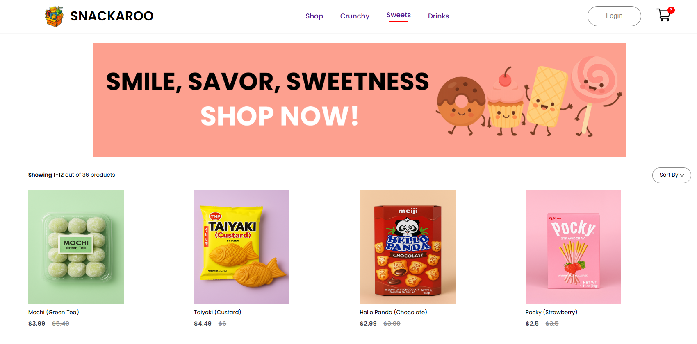

# 🍱 Snackaroo – Asian Snack Delivery (Frontend)

**Snackaroo** is a fun and responsive frontend web application that showcases a curated collection of Asian snacks — crunchy bites, sweet treats, and refreshing drinks — available exclusively for Stony Brook University campus delivery.

> 🚧 This repository currently contains the **frontend only**. The backend will be added soon in a separate folder.

---

## 🖼️ Preview

  
_Example: Product page for Ramune, product filtering, and responsive cart view_

##  🌍 LIVE DEMO:
- Try it Out: https://chrisw0987.github.io/snackaroo/
---

## 🛠️ Tech Stack

- **React.js** (via Vite or Create React App)
- **React Router DOM** for routing
- **Context API** for global cart state
- **CSS Modules** or global CSS for styling
- **Responsive Design** (media queries)

---

## 📦 Features

- 🛍 Browse by category: Crunchy, Sweets, and Drinks
- 🔍 Product detail view with quantity selector
- 🧮 Add-to-cart with persistent global state
- 💸 Dynamic pricing (old/new price)
- 🌐 Responsive layout (mobile-friendly)

---

## 🚀 Getting Started

### 1. Clone the repo
```bash
git clone https://github.com/chrisw0987/snackaroo.git
cd snackaroo/frontend
